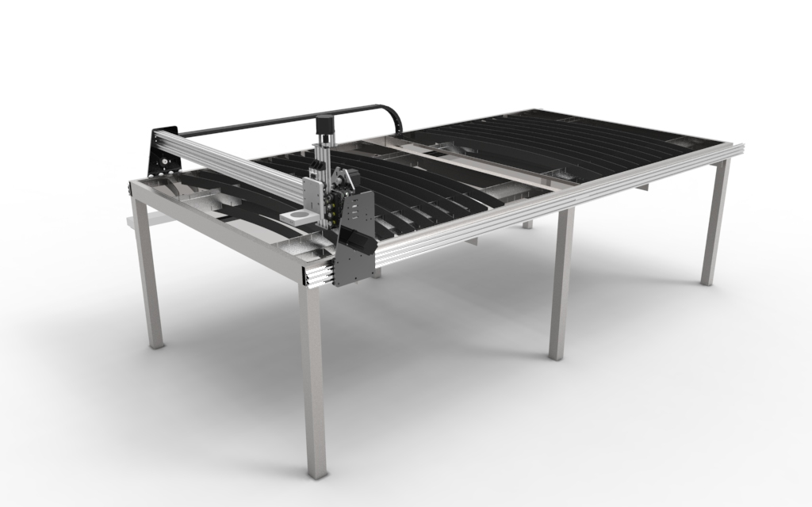

# Introduction
<iframe width="100%" height="500" src="https://www.youtube.com/embed/ObLvATzSDjQ" frameborder="0" allow="accelerometer; autoplay; encrypted-media; gyroscope; picture-in-picture" allowfullscreen></iframe>




# Release notes 🚀
This product is under a final development stage, therefore the documentation provided is still incomplete. The goal is to make it easy for people to get **built this cnc plasma cutter for usage** or **order a kit that can be assembled locally**. The content and ``.md`` files eventually will document all the information to use CAD, CAM files, as well as folder structure and more.

#### To suggest design improvements or content suggestions go to **```CONTRIBUTING-GUIDElines.md```** 👆
